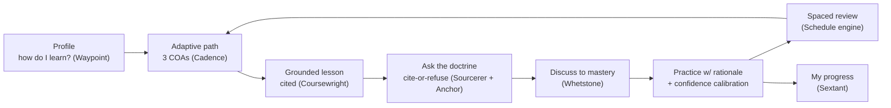
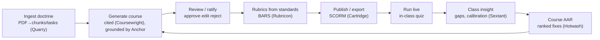

# 00 · North Star

> **SchoolCircleLMS** — one grounded platform that is, at the same time, the **ultimate learning loop** for the Marine and the **ultimate course build / plan / review tool** for the instructor. SchoolCircle is the surface; **Anchor** is the offline grounding engine underneath; twelve standalone Apache-2.0 libraries do the work.

This document is the top of a build-spec stack. A fresh engineer (or a fresh Claude Code instance) should be able to read this stack top-to-bottom and rebuild the platform in the right design, wired to the real repos and Anchor, without guessing.

---

## The one-sentence pitch

AI-native training that **won't make things up**: every claim traces to the manual, is verified on-device, or is refused — and the instructor ratifies everything before a Marine sees it. It runs offline on a $500 Jetson.

## Four principles (non-negotiable)

| Principle | What it means in code |
|---|---|
| **Grounded** | Cite-or-refuse. Answers come from retrieved paragraphs with a page-level citation, or the system abstains. Never invent doctrine, pub numbers, or standards. |
| **Verified** | Proven, not asserted. On-device HHEM entailment checks each answer's support; grounding / rubric reliability / doctrinal fidelity are *measured*. |
| **Offline** | Edge-first. The whole delivery loop runs on a Jetson Orin with the network pulled. Delivery costs $0. One schema runs Postgres (enterprise) or SQLite (edge) on a connection-string swap. |
| **Human-led** | AI drafts; a human ratifies. Nothing `PENDING` reaches a student. The boundary is a feature, stated in the demo. |

## Guardrails (from the schoolhouse brief — state them out loud)

- **No AI in proctoring** or proctor-code creation. Human input only, by design.
- **The instructor owns the authoritative content.** AI drafts around it; it never overwrites it.
- **AI drafts, humans ratify.** Every generated assessment is reviewed and approved before use.

---

## The two loops

Everything the platform does closes one of two loops. Build both to *close*, not just to render screens.

### The learner loop — a clear path to mastery

The engine detail that makes it "ultimate": every practice attempt captures **confidence before the reveal**, so the platform catches the *confidently wrong* learner a normal quiz hides, and it feeds a **confidence-weighted spaced-repetition** schedule. See [06-learner-loop.md](06-learner-loop.md).

### The instructor loop — command of the course

Insight is **aggregate by construction** — the class view is a `GROUP BY` over attempts that never selects a learner id, so an instructor sees where the *class* is weak but cannot be handed one Marine's answers. See [03-data-model.md](03-data-model.md).

---

## The twelve soldiers, mapped to the loops

| Repo | Loop role |
|---|---|
| **Anchor** | Grounds *everything* — retrieval · cite-or-refuse · HHEM verification, offline. The engine under both loops. |
| **Quarry** | Instructor · ingest: PDFs → clean text, retrieval-sized chunks, structured T&R tasks. |
| **Coursewright** | Instructor · generate: objectives + cited passages → a full course (lessons/questions/scenario). |
| **Rubricon** | Instructor · assess: a T&R standard → a behaviorally-anchored rating scale + rater-reliability. |
| **Cartridge** | Instructor · export: a course → a SCORM 1.2/2004 package for MarineNet/Moodle. |
| **Sextant** | Both · measure: learning gain, class gaps, competency evidence — aggregate, privacy-safe. |
| **Hotwash** | Instructor · improve: end-of-course critiques → a ranked AAR across class iterations. |
| **Sourcerer** | Learner · ask: cite-or-refuse Q&A over the corpus, with a faithfulness check. |
| **Whetstone** | Learner · master: conversational discuss-to-mastery against a rubric. |
| **Cadence** | Learner · plan: syllabus + calendar → a study plan across three COAs, with `.ics` export. |
| **Waypoint** | Learner · profile: a "how do I learn?" survey → per-learner and per-class lesson-planning guidance. |
| **Understudy** | Both · gate: a doctrine-bound agent + a fidelity benchmark that keeps answers on the leash. |

All twelve are public, Apache-2.0, tested, and CI-green under `github.com/jeranaias`. Exact install/exports/contracts: [05-arsenal-contracts.md](05-arsenal-contracts.md).

---

## How to read this stack

1. **[01-design-system.md](01-design-system.md)** — tokens, the shell, every component, the two widgets. Build in *this* look.
2. **[02-architecture.md](02-architecture.md)** — the spine, edge/host/cloud, the three flows, the adapter pattern.
3. **[03-data-model.md](03-data-model.md)** — the Prisma schema, the privacy boundary, the edge swap, MarineNet-readiness.
4. **[04-grounding-and-anchor.md](04-grounding-and-anchor.md)** — the Anchor adapter contract (exact JSON), abstention-returns-200, the premise gate.
5. **[05-arsenal-contracts.md](05-arsenal-contracts.md)** — each repo: install, exports, the exact call, in/out.
6. **[06-learner-loop.md](06-learner-loop.md)** — the learner experience, screen by screen + the calibration/spacing engine.
7. **[07-instructor-loop.md](07-instructor-loop.md)** — the build/plan/review experience, screen by screen.
8. **[08-build-guide.md](08-build-guide.md)** — gameday assembly: scaffold → install arsenal → prisma → env → wire → run.
9. **[09-roadmap.md](09-roadmap.md)** — from MVP to the ultimate version.

The two companion artifacts — the **Cold Bore plan** (battle plan / assembly) and the **Range Card** (operator brief / demo runbook / integration wiring) — are the field references; this stack is the build spec behind them.
