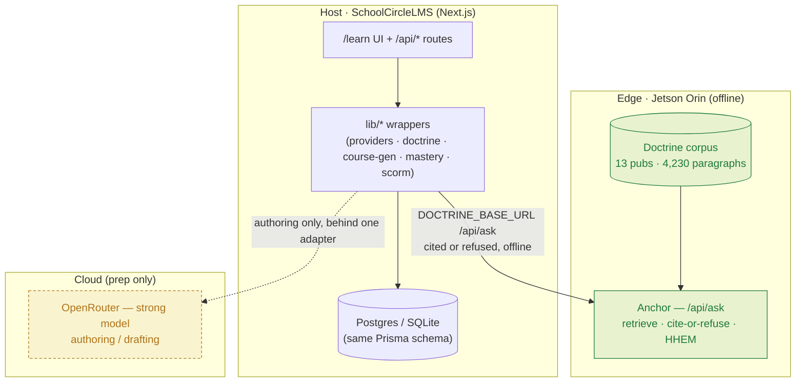

# 02 · Architecture

How SchoolCircleLMS is wired. The one idea to hold onto: **every feature is the same spine wearing a different face.** Build the spine once; each surface is a different input→output binding on it.

See also: [01 · Design System](01-design-system.md) · [03 · Data Model](03-data-model.md) · [04 · Grounding & Anchor](04-grounding-and-anchor.md) · [05 · Arsenal & Contracts](05-arsenal-contracts.md) · [06 · Learner Loop](06-learner-loop.md) · [07 · Instructor Loop](07-instructor-loop.md).

---

## The spine

Everything the platform generates or answers runs the same four steps:

```
Ground  →  Cite-or-refuse  →  Verify (HHEM)  →  Human review
```

1. **Ground** — retrieve the exact passages for the task from the indexed corpus (Anchor: BM25 + dense + rerank). The model answers *from retrieved paragraphs*, never from memory.
2. **Cite-or-refuse** — answer only from those passages, each factual sentence carrying a paragraph-level citation; abstain when retrieval doesn't support one. Abstention is a correct answer, not an error (see [04](04-grounding-and-anchor.md)).
3. **Verify** — an on-device HHEM entailment check scores faithfulness before anything is shown; the premise gate catches a smuggled false specific that retrieval scores high. Low score → don't show.
4. **Human review** — an instructor approves, edits, or rejects. Nothing `PENDING` reaches a learner (`ItemStatus` in [03](03-data-model.md)).

Because the guarantee lives in the spine, it holds identically for a generated course, a tutor answer, a rubric, and a quiz. That is why "grounded" is a property of the platform, not a promise on one screen.

---

## Topology — edge / host / cloud



- **Edge (Anchor)** grounds every answer and runs fully offline on a ~$500 Jetson Orin Nano. Delivery never needs the network. See [04](04-grounding-and-anchor.md).
- **Host (SchoolCircleLMS)** is one Next.js app: the `/learn` UI, `/api/*` route handlers, `lib/*` wrappers, and a Prisma DB. It orchestrates; Anchor grounds.
- **Cloud (OpenRouter)** is reached **only** for authoring (drafting a course from a POI) and only behind the adapter. If it is blocked, late, or swapped, one file changes — delivery is unaffected.

---

## The three flows (the app's backbone)

Every screen belongs to one of three flows. The screen-level loops are specified in [06 · Learner Loop](06-learner-loop.md) and [07 · Instructor Loop](07-instructor-loop.md); the exact call chains (route → `lib` fn → repo → Anchor → Postgres table) are the **sequence diagrams in the Range Card** — treat those as the wiring source of truth.

| Flow | Runs | What moves |
|---|---|---|
| **① Author** | prep (cloud allowed) | Doctrine PDF/POI → Quarry → Anchor (index) → Coursewright + Rubricon (cited course + BARS) → instructor review → Cartridge (SCORM) |
| **② Deliver** | edge, offline | learner question/answer → Sourcerer / Whetstone → Understudy (fidelity) → Anchor (cite-or-refuse · HHEM) → cited answer / coached / refused |
| **③ Improve** | the loop | attempts · turns · critiques → Sextant (gain · gaps · evidence) → Insight (class) · Hotwash (course AAR) → Cadence (next study plan) → feeds the next course |

---

## The adapter pattern (why one file changes, not the app)

All model access goes through a single capability registry — `lib/providers.js`. Feature code never imports a vendor SDK directly.

- **`text`** — the authoring model (OpenRouter/Gemini by default). Marked **critical**: if absent, `/api/capabilities` reports it in the blocking set.
- **`grounding`** — the Anchor doctrine adapter (`lib/doctrine.js`). Marked **non-critical**: with `DOCTRINE_BASE_URL` unset, nothing breaks; `/api/capabilities` reports grounding unavailable with a reason and the app still runs.

Every model call is env-configurable (`OPENROUTER_API_KEY`, `<CAP>_ENDPOINT`, `<CAP>_MODEL`, `DOCTRINE_BASE_URL`). **A local dev path must exist regardless of what compute the event provides** — that is a build-week risk, not a stack choice. The gameday compute ("supercomputer allocation") plugs in behind the same `text` adapter with one env change.

---

## Offline & resilience

- **SQLite swap for the edge.** The same Prisma schema runs on SQLite: change the `datasource` provider and point `DATABASE_URL` at a file — nothing else. That is the edge-to-enterprise story: one schema, connection-string swap ([03](03-data-model.md)).
- **$0 at delivery.** With the corpus indexed and the app on the edge, delivering training costs nothing and works with the plug pulled.
- **Degrade, don't crash.** If the Anchor tunnel drops, the tutor falls back to Postgres full-text search over `Chunk` — still returning cited answers (`source = fts`), never an ungrounded guess. Anchor's own HHEM verifier fails open (a verifier outage degrades to answering, not to crashing).

---

## Next.js structure

```
app/
  learn/                     the product (instructor + student surfaces)
    page.js, studio/, rubrics/, ask/, mastery/, quiz/, insight/, [section]/
  api/
    generate/course/         POST → SSE course generation (Coursewright + Anchor)
    ask/                     POST → tutor.askDoctrine (Sourcerer + Anchor, FTS fallback)
    rubric/generate/         POST → Rubricon
    mastery/start|turn/      POST → Whetstone
    attempts/                POST → record an Attempt (confidence + correct)
    plan/                    POST → Cadence (study plan)
    scorm/[courseId]/        GET  → Cartridge (SCORM zip)
    ingest/corpus/           POST → Quarry chunks → Chunk table
    doctrine/, capabilities/, items/[id]/action/, auth/
lib/
  providers.js               capability registry (text critical, grounding non-critical)
  doctrine.js                Anchor adapter (DOCTRINE_BASE_URL → /api/ask)
  course-gen.js              generateCourse(poi, emit) — grounded via ask()
  rubric-gen.js, mastery.js, scorm.js, db.js, poi-parser.js, tr-tasks.js
prisma/schema.prisma         one schema, Postgres or SQLite
```

Route handlers are the seam between UI and the platoon; `lib/*` wrappers are where each open-source repo is consumed ([05](05-arsenal-contracts.md)). Keep vendor/model calls inside `lib/*` — the routes and UI stay provider-agnostic.
