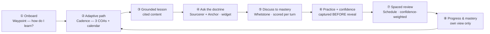

# 06 · The Learner Loop

The ultimate learning loop for a Marine: a closed cycle that starts by learning *how they learn*,
routes them through grounded material at the right pace, proves mastery honestly, and comes back
around sharper every pass. Nothing a student sees is ungrounded, and nothing reaches them that an
instructor didn't ratify (see [03 · Data Model](03-data-model.md), `Item.status`).

The loop is deliberately a cycle, not a funnel: step ⑧ feeds step ② — the plan re-forms every day
from where the learner actually is.

---

## The three engines that make it "ultimate"

Most LMS "adaptivity" is a completion checkbox and a linear playlist. Three things set this loop apart,
and all three are already modeled in the schema:

### 1. Confidence calibration (the confidently-wrong learner)
Every practice item captures **confidence before the reveal** (`Attempt.confidence`, 0=guessing …
3=certain). Paired with `correct`, this exposes the learner a normal quiz hides: the one who is
**confident and wrong**. A quiz that only scores right/wrong treats "lucky guess" and "solid mastery"
as identical, and "confidently wrong" as just another miss. Calibration separates them — and
`Mastery.calibrationGap` surfaces it to the learner ("you're sure on things you're getting wrong here")
and, in aggregate, to the instructor (see [07](07-instructor-loop.md)).

### 2. Spaced repetition (confidence-weighted)
Finishing a topic doesn't retire it. Each reviewable item gets a `Schedule` row with a `dueAt` and an
`interval` (days) that **grows or shrinks with the learner's confidence-and-correctness** — a shaky
or confidently-wrong item comes back soon; a calibrated-correct one spaces out. This is what turns a
one-time pass into durable retention, and it's why the dashboard's "up next" is never empty.

### 3. Adaptivity from mastery + gaps
The path (Cadence) re-plans from real signals — `Mastery` per section, the learner's weakest topics,
and what's due for review — not from a fixed sequence. Behind → catch up; on track → maintain; ahead →
get ahead (see [05 · Arsenal](05-arsenal-contracts.md) → cadence).

Everything above runs **grounded and offline-capable**: lessons, tutor answers, and practice rationale
all trace to a cited paragraph or are refused (see [04 · Grounding & Anchor](04-grounding-and-anchor.md)).

---

## Screen specs

### Dashboard
The learner's home. Answers "what do I do next?" in one glance.
- **Up next** — the single highest-priority action (overdue review, a due mastery check, the next
  lesson), pulled from `Schedule` (due) + `Mastery` (weak) + the active path.
- **My courses** — course cards with a big **mastery %**, a progress bar (week / weeks), and the
  weakest topic called out in scarlet.
- **Required training** — auto-enrolled CY/FY + EPME requirements with status (complete / due / overdue).
- **To-do** agenda — the near-term queue.
- *Design*: cards + tiles + progress bars per [01](01-design-system.md). *Data*: `Course`, `Mastery`,
  `Schedule`, `Attempt` (learner-scoped only).

### My Course → Lesson reader
The course as the POI lays it out — annexes → lessons → assessment → scenario.
- Module tree with per-lesson status (complete / current / upcoming) and hours.
- **Lesson reader**: cited body content, a **key-points** card, a **clickable citation** that opens the
  exact grounded passage + page locator (the trust-on-tap moment), **Mark complete**, **Ask about
  this →** (hands the lesson context to the tutor), and prev/next.
- *Data*: `Section`/`Item` (kind `LESSON`, `APPROVED` only), `Item.citation`. *Repos*: coursewright
  built it; quarry cut the corpus.

### Ask the doctrine (screen + persistent widget)
The tutor. Available as a full screen **and** as the persistent bottom-right chat widget on every
screen (so a stuck learner never has to leave what they're doing).
- Chips for common questions + free-text input.
- Answers are **cite-or-refuse**: a grounded answer carries a citation and an HHEM-verified badge; an
  out-of-corpus question gets an honest refusal, not a guess. The `Understudy` fidelity gate keeps the
  answer on-doctrine.
- *Repos*: sourcerer + anchor (+ understudy). *Contract*: [04](04-grounding-and-anchor.md). *Route*:
  `POST /api/ask`. *Reads*: `Chunk` (FTS fallback if the tunnel drops — still cited).

### Mastery check
Discuss-to-mastery, not a multiple-choice gate.
- A conversational check (`Whetstone`) that derives a rubric from the objective, opens with a question,
  and **scores each answer against the rubric**, coaching the gap and advancing when a criterion is met.
- The **rubric criteria fill in visibly** as the learner demonstrates each — mastery is legible, not a
  black-box score. Sessions always terminate (attempt/turn caps → a recorded partial if stalled).
- *Repo*: whetstone. *Routes*: `POST /api/mastery/start`, `/api/mastery/turn`. *Writes*: `Attempt`,
  `Mastery`.

### Study Plan
The calendar half of the loop.
- The learner's status (behind / on track / ahead) and a plan across **three courses of action**
  (Cadence), laid out on a **week calendar** with blocks placed by day, plus spaced-review blocks.
- **Export to calendar (.ics)** with reminders — the plan leaves the app and lands in Outlook/Google.
- *Repo*: cadence. *Route*: `POST /api/plan`. *Writes*: `Schedule`.

### My Progress
The learner's own evidence — **theirs only** (the aggregate class view is the instructor's, and is a
query that never selects `learnerId`; see [03](03-data-model.md)).
- Mastery bars by topic; **learning gain** pre→post; and the **calibration gap** — the honest signal
  most LMSs never show a learner.
- *Repo*: sextant (learner-scoped read). *Reads*: `Mastery`, `Attempt` (self).

---

## Data touchpoints at a glance

| Step | Screen | Repo(s) | Route | Tables |
|---|---|---|---|---|
| ① Onboard | (survey) | waypoint | — | (profile → planning) |
| ② Path | Study Plan | cadence | `/api/plan` | Schedule |
| ③ Lesson | Course / Lesson | coursewright · quarry | — | Section, Item, citation |
| ④ Ask | Ask + widget | sourcerer · anchor · understudy | `/api/ask` | Chunk |
| ⑤ Mastery | Mastery check | whetstone | `/api/mastery/*` | Attempt, Mastery |
| ⑥ Practice | Quiz/practice | coursewright + grounding | `/api/attempts` | Attempt (confidence) |
| ⑦ Review | Dashboard up-next | cadence / spacing | `/api/plan` | Schedule |
| ⑧ Progress | My Progress | sextant | — | Mastery, Attempt (self) |

See [05 · Arsenal & Contracts](05-arsenal-contracts.md) for each repo's exact API, and
[01 · Design System](01-design-system.md) for the components each screen is built from.
