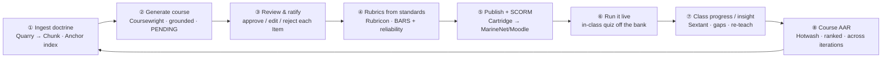

# 07 · The Instructor Loop

The ultimate course-building, planning, and reviewing tool for an instructor: a closed cycle that
turns raw doctrine into a cited course, keeps a human in command of everything the AI drafts, measures
where the class actually is without ever exposing an individual, and feeds the next iteration. The
instructor is the authority at every step — **AI drafts, the instructor ratifies** (see
[00 · North Star](00-north-star.md)).

Step ⑧ feeds step ①: the AAR's ranked fixes and the class's gaps shape what the next course emphasizes
and re-teaches. The loop gets sharper every cycle — that's the whole point of grading the *course*, not
just the student.

---

## What makes it "ultimate"

- **Grounded generation, not a prompt.** Every generated claim/question/scenario is retrieved-and-cited
  or dropped; the review screen shows the citation so ratifying is *checking a paragraph*, not
  re-deriving from the POI by hand (see [04 · Grounding & Anchor](04-grounding-and-anchor.md)).
- **Human-in-the-loop is enforced in the schema.** Nothing `PENDING` reaches a student
  (`Item.status`); approval is a hard gate, not a convention.
- **Insight without surveillance.** The class view is a query that never selects `learnerId`
  ([03 · Data Model](03-data-model.md)); the instructor sees where the *class* is weak — including the
  **confidently-wrong cohort** from calibration — and cannot be handed one Marine's answers.
- **The course improves itself.** Hotwash reads end-of-course critiques *across iterations* and ranks
  fixes into short-term vs structural — the drawer of critiques becomes a worklist.

---

## Screen specs

### Dashboard
Command view for the instructor's courses.
- **Tiles**: active courses, students, **pending review** (the human-in-the-loop backlog), avg mastery.
- **Course cards** with mastery %, week, weakest topic.
- **The build loop** as four next-cards (Integrate → Ratify → Measure → Improve) — the loop above, one
  click each.
- **Recent activity** + a "needs attention" nudge (pending review, weakest topic).
- *Data*: `Course`, `Item` (PENDING count), `Mastery`, `Attempt` (aggregate).

### Studio — build a course
Where doctrine becomes a course.
- **Source corpus** (a PDF/POI cracked by Quarry into chunks + tasks; Anchor indexes it).
- **Program of instruction** textarea → **Generate** runs the grounded pipeline live
  (Quarry → Anchor retrieve → Coursewright draft → HHEM verify), shown as animated steps.
- Output is a **course tree** (modules → lessons / assessment / scenario), every item **cited** and
  **PENDING**, with a **coverage summary** ("4/4 objectives grounded · 1 claim dropped — unsupported").
- *Repos*: quarry → coursewright (grounded by anchor). *Route*: `POST /api/generate/course` (SSE
  progress). *Writes*: `GenJob`, `JobEvent`, `Course`/`Section`/`Item` (PENDING).

### Review — ratify
The guardrail made a screen.
- Each generated `Item` with its text, **citation**, and **approve / edit / reject**; **inline edit**
  keeps the instructor's pen on it; a live "X of N reviewed" progress bar.
- **Publish & export**: publish to the class, and **export a SCORM package** (Cartridge) that drops into
  MarineNet / Moodle and reports completion + score.
- *Repos*: coursewright (revise), cartridge (export). *Routes*: `POST /api/items/:id/action`,
  `GET /api/scorm/:courseId`. *Writes*: `Item.status`.

### Rubrics
Turn a raw standard into a defensible rating scale.
- A Training & Readiness standard → **BARS anchors** (unsat / satisfactory / proficient), each **traced
  to a performance step**, with **inter-rater reliability** (Cohen's / weighted / Fleiss' κ). A standard
  too vague to anchor is **flagged for the SME**, not guessed (flag-ambiguous → abstain).
- *Repo*: rubricon. *Route*: `POST /api/rubric/generate`, `/api/rubric/:id/review`. *Writes*: `Rubric`.

### Run it live
The in-class read.
- A competitive live quiz off the generated question bank — a real-time read on where the class is
  before the block exam (the "embedded Kahoot" ask from the brief; wiring in [09 · Roadmap](09-roadmap.md)).
- *Repo*: coursewright (bank). *Writes*: `Attempt`.

### Class Progress / Insight
The reports screen — evidence, not surveillance.
- **Sextant**: avg mastery, **learning gain** (Hake's g), **mastery by topic worst-first** (drives the
  re-teach), the **confidently-wrong cohort**, and an at-risk count — all **aggregate, privacy-by-query**
  (never selects `learnerId`; small-cell suppression via `minCohort`).
- **Insight loop**: one click drafts a short, **cited re-teach** for the weakest topic.
- **Class learning profile** (Waypoint): the cohort's modality mix ("58% hands-on → more range time")
  feeding lesson planning.
- *Repos*: sextant (+ waypoint). *Reads*: `Attempt`/`Mastery` (aggregate only). *Route*: `/learn/insight`.

### Course AAR
Grade the curriculum.
- **Hotwash**: end-of-course critiques + attempt trends **across class iterations**, ranked by impact
  into **short-term fixes vs structural (long-term) redesign**, with a **severity trend** per finding and
  a drafted AAR memo.
- *Repo*: hotwash. *Route*: `POST /api/aar` (planned). *Reads*: `Attempt` + critiques.

---

## Data touchpoints at a glance

| Step | Screen | Repo(s) | Route | Tables |
|---|---|---|---|---|
| ① Ingest | Studio (source) | quarry · anchor | `/api/ingest/corpus` | Chunk |
| ② Generate | Studio | coursewright | `/api/generate/course` (SSE) | GenJob, JobEvent, Course/Section/Item (PENDING) |
| ③ Ratify | Review | coursewright | `/api/items/:id/action` | Item.status |
| ④ Rubrics | Rubrics | rubricon | `/api/rubric/generate` | Rubric |
| ⑤ Publish/export | Review | cartridge | `/api/scorm/:courseId` | reads Course/Section/Item |
| ⑥ Live | Run it live | coursewright | (live) | Attempt |
| ⑦ Insight | Class Progress | sextant · waypoint | `/learn/insight` | reads Attempt/Mastery (aggregate) |
| ⑧ AAR | Course AAR | hotwash | `/api/aar` (planned) | reads Attempt + critiques |

See [05 · Arsenal & Contracts](05-arsenal-contracts.md) for each repo's exact API,
[03 · Data Model](03-data-model.md) for the tables and the privacy boundary, and
[01 · Design System](01-design-system.md) for the components each screen is built from.
