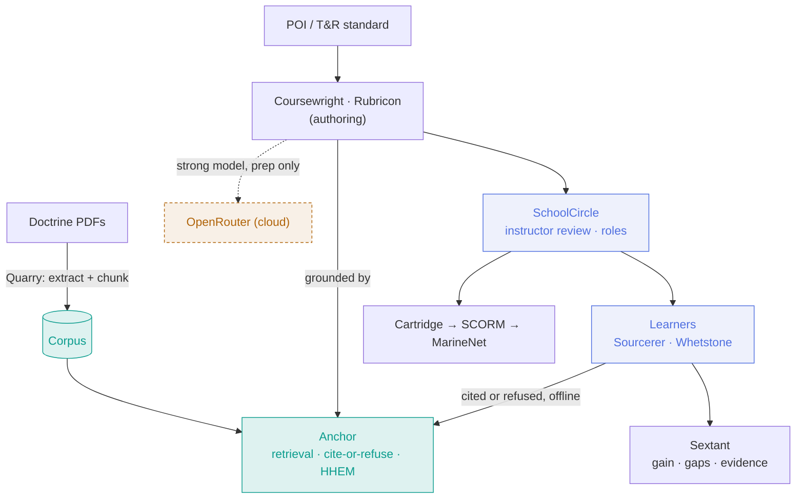
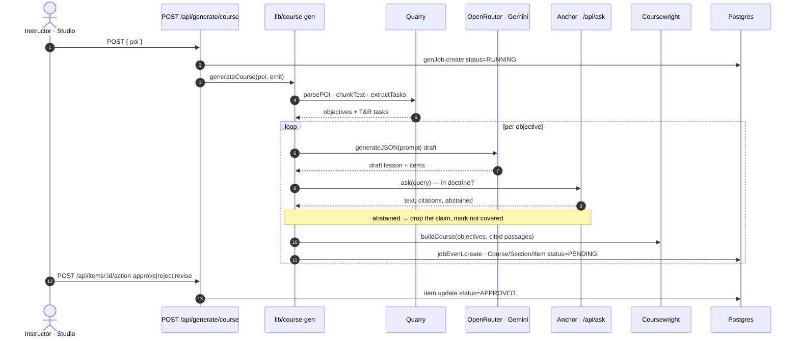
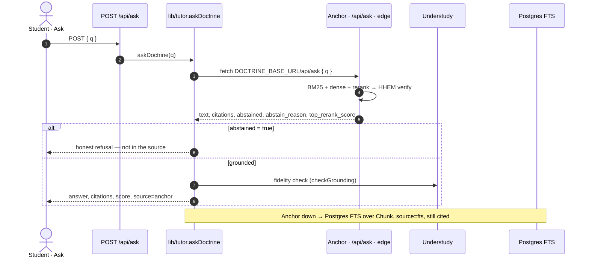
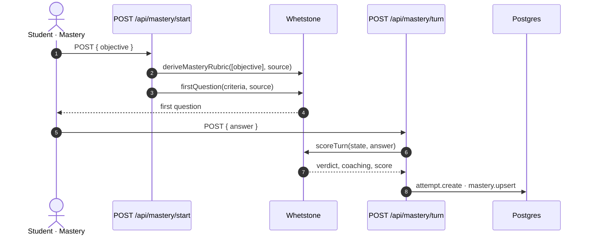
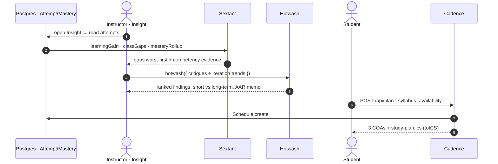

# Operation Cold Bore — Range Card

> The gameday operator's brief — pitch, live-demo runbook, contingencies, architecture, the platoon wired piece-by-piece into the app, metrics, and submission package.

**Tags:** Gameday Brief · Companion to Operation Cold Bore · Unclassified · Releasable

## Operation Cold Bore — Range Card

The shooter's reference for making the shot — the pitch, the live-demo runbook, the contingencies, the architecture, the platoon wired piece-by-piece into the app, the numbers, and the submission package. One card, so the demo runs cold and the story lands.

## PITCH — Ninety seconds, said out loud

**The problem.** AI can generate training fast — but it hallucinates, and a wrong "fact" in doctrine is a training failure that follows a Marine to the fight. And the schoolhouse or the field often has no reliable network.

**What we built.** One grounded platform — SchoolCircle on the surface, Anchor grounding it on a Jetson Orin — that generates cited courses, tutors from the source, and assesses Marines to mastery on real doctrine, **offline**.

**Why it wins.** It isn't another chatbot. It's **grounded** (every claim cites the manual, or it refuses), **verified** (HHEM on-device, and grounding / rubrics / fidelity are all proven not asserted), **offline** (runs on a $500 board with the network pulled), and **human-led** (nothing unreviewed reaches a student). And it's **open** — standalone Apache-2.0 products any command can adopt.

**The ask.** Adopt at the schoolhouse, edge-first, open-source. The pieces are already public, tested, and green.

## NUMBERS — By the numbers

Measured live on the actual stack. The soft ones (cost) are honest estimates, flagged as such.

| Metric | What it is |
| --- | --- |
| **~5s** | grounded, cited answer (edge, HHEM-verified) |
| **~4.5s** | T&R standard → a full BARS rubric |
| **5/5** | out-of-doctrine questions correctly refused (100%) |
| **4,230** | grounded chunks on the edge · 13 pubs |
| **146** | real NAVMC 3500.44E tasks, BARS-ready |
| **12 · 700+** | open-source repos · passing tests (hardened) |
| **~$0.10** | est. per generated course · **$0** at delivery (offline) |
| **8 / 17** | use cases backed by a real product |

## ARCHITECTURE — How it's wired

Authoring reaches a strong cloud model (unclassified prep only). Delivery is fully on the edge — Anchor grounds every answer, offline. Cite-or-refuse sits on the retrieval path.



## PLATOON — Piece by piece — how each soldier plugs in

Not arrows and vibes: the real call chain for each flow, exactly as it's wired into SchoolCircle. Every message below is an actual route, `lib` function, or repo call in the app — with the point where it hits Anchor and the Postgres table it writes. Read each diagram top to bottom.

### ① AUTHOR — Studio generates a cited course

Quarry cracks the POI into objectives and tasks; a strong model drafts each lesson; **Anchor grounds every claim or the claim is dropped**; Coursewright assembles it; nothing leaves `PENDING` until the instructor approves it.



Rubrics run the same shape on their own route: `POST /api/rubric/generate` → **Rubricon** `generateRubric(task)` → `Rubric.create`; a standard too vague to anchor is **flagged for the SME**, not guessed.

### ② DELIVER · ASK — The tutor answers from the source — or refuses

Runs on the edge. The refusal branch is the whole point: when Anchor abstains, the tutor says so instead of inventing. If the Orin link ever drops, Postgres FTS answers — still with citations.



### ③ DELIVER · MASTERY — Discuss to a recorded mastery score

Whetstone derives a rubric from the objective, opens with a question, then scores each turn and coaches the gap — every attempt written to Postgres for the analytics flow to read.



### ④ IMPROVE — Analytics, the course AAR, and the next study plan

The loop that makes it sharper each cycle. Sextant reads the attempts into class gaps; Hotwash grades the course across iterations; Cadence turns a syllabus + calendar into a plan the learner's calendar can import.



### The full integration map

Every soldier, its entry point in the app, the exact call, how it's grounded, and what it persists. Routes and functions are the real ones in the codebase.

| Soldier | Entry point | Exact call | Grounding | Persists / reads |
| --- | --- | --- | --- | --- |
| **Anchor** `ship` | `DOCTRINE_BASE_URL/api/ask` | the call every soldier makes to ground | BM25 + dense + rerank + HHEM | Chunk corpus (on the edge) |
| **Quarry** `ship` | `POST /api/ingest/corpus` · `/api/pdf-text` | `pdfText` · `parsePOI` · `chunkText` · `extractTasks` | — | `Chunk.createMany` {source, ord, text} |
| **Coursewright** `ship` | `POST /api/generate/course` (SSE) | `generateCourse(poi, emit)` → `buildCourse` | `ask()` → Anchor; abstain drops the claim | GenJob · JobEvent · Course · Section · Item (PENDING) |
| **Rubricon** `ship` | `POST /api/rubric/generate` · `/rubric/:id/review` | `generateRubric(task)` | flag-ambiguous → abstain | `Rubric.create` |
| **Sourcerer** `ship` | `POST /api/ask` | `tutor.askDoctrine(q)` | Anchor cite-or-refuse | reads Chunk (FTS fallback) |
| **Understudy** `ship` | behind `/api/ask` | `checkGrounding` · `fidelityReport` | gates the answer before it ships | — |
| **Whetstone** `ship` | `POST /api/mastery/start` · `/turn` | `deriveMasteryRubric` · `firstQuestion` · `scoreTurn` | grounded in the objective's source | `Attempt.create` · `Mastery.upsert` |
| **Sextant** `ship` | `/learn/insight` · lib `classGaps()` | `learningGain` · `classGaps` · `masteryRollup` | — | reads Attempt / Mastery |
| **Cartridge** `ship` | `GET /api/scorm/:courseId` | `buildScormZip(course)` | — | reads Course / Section / Item |
| **Cadence** `ship` | `POST /api/plan` (+ Schedule model) | `plan()` · `toICS()` | — | `Schedule.create` |
| **Hotwash** `ship` | `POST /api/aar` (planned) | `hotwash()` · `narrativeAAR()` | — | reads Attempt + critiques |
| **Waypoint** `ship` | `/learn/profile` (planned) | `profile()` · `classProfile()` | — | learner responses → faculty view |

The `verification throughline`: Rubricon proves **grounding**, Sourcerer proves **faithfulness**, Whetstone proves **mastery**, Sextant proves **learning gain**, Understudy proves **doctrinal fidelity**. Five soldiers, five things proven not asserted.

## RUNBOOK — Preflight — before you stand up

Run this cold once, then again right before you present. Everything green = safe to shoot.

```bash
docker start schoolcircle-dev          # local Postgres
bash ops/tunnel.sh                     # workstation :8000 → Anchor on the Orin (KEEP OPEN)
npm run dev                            # the app on :3111
bash ops/orin-check.sh                 # link · services · health · corpus · key — all green
# then in the app: open /learn/ask, ask "what is trigger control?" → confirm source = anchor
```

⚠ The Anchor tunnel is **not** persistent — if the tutor ever shows `source = fts`, re-run `ops/tunnel.sh`. (If it drops mid-demo, the FTS fallback still answers *with citations* — degrade, don't crash.)

## SHOW — The five-minute shot

1. **The problem.** *(0:45)* Say the 90-second pitch above. Land on: "not another hallucinating chatbot."
2. **Generate.** *(1:00)* **Studio** → paste the POI → generate a grounded course live, or reveal the banked golden course. Every lesson cited, all pending review.
3. **Trust it — the mic drop.** *(1:00)* **Ask** → type `What is trigger control?` → cited answer, HHEM badge. Then `What's the max range of a Javelin?` → **it refuses.** Let that land.
4. **Rubric from a raw standard.** *(1:00)* **Rubrics** → pick *Defend a Position* → BARS anchors, traceable. Then a vague standard → **flagged for the SME**, not guessed.
5. **Prove it teaches.** *(0:45)* Flip the role switch to **Learner** → **Mastery** → give a weak answer (coached), then a strong one (mastered, score recorded).
6. **Where it runs.** *(0:30)* Pull the network — the tutor still answers, offline. Then **Export SCORM** → "drops into MarineNet."

## CONTINGENCY — If it breaks, do this

- **tunnel drops** → **Tutor shows source = fts.** It still cites — keep going, or re-run `ops/tunnel.sh` between beats.
- **no venue network** → **That's the demo.** Delivery is offline by design; authoring was pre-done. Show the banked course + the live refusal.
- **generation slow/fails** → **Reveal the banked golden + MCPP courses.** Live generation is a bonus, never a dependency.
- **cloud/OpenRouter blocked** → **Skip live generation.** Everything downstream (tutor, mastery, viewing, SCORM) runs without it.
- **docker / db down** → `docker start schoolcircle-dev`, wait for `pg_isready`, refresh.

## SUBMIT — Submission package

The fields the use-case pages ask for, mapped to what we have.

| Field | Status | What it is |
| --- | --- | --- |
| **Working prototype** | Ready | SchoolCircle at `/learn` — generate · tutor · rubric · mastery · SCORM · roles |
| **Demo link** | Live | [jeranaias.github.io/grounded-training-demo](https://jeranaias.github.io/grounded-training-demo) (+ the interactive system at `/app.html`) |
| **Repository** | Public | the Apache-2.0 platoon under `github.com/jeranaias` |
| **Architecture diagram** | Above | edge / host / cloud, plus the piece-by-piece integration sequences |
| **Tools used** | Listed | Next.js · Prisma · Postgres · Jetson Orin · llama.cpp · bge · HHEM · OpenRouter (Gemini) · Apache-2.0 |
| **Presentation** | This + pitch | this Range Card + the 90-second pitch; build slides only if the venue requires a deck |
| **Transition vision** | Below | schoolhouse adoption · edge-first · open-source |

## TRANSITION — Where it goes after the win

- **Adopt at the schoolhouse, edge-first.** The grounding engine runs on a ~$500 Jetson at the schoolhouse or in the field — no cloud, no waiting on an ATO to *deliver* training. Delivery costs $0 and works with the plug pulled.
- **Open-source, adopt a piece or the platform.** Standalone Apache-2.0 products. A program that only needs rubrics takes Rubricon; one that needs the whole loop takes them all. No lock-in, no license.
- **MarineNet is the front door, not a rebuild.** LTI 1.3 launches the live enclave-hosted app with grade passback; SCORM export ships a static bundle from the same codebase. Auth sits behind one swappable seam (→ CAC / SSO).
- **Grows with the corpus.** Swap the doctrine, regenerate — the platform is topic-agnostic. Proven on rifle marksmanship *and* the Marine Corps Planning Process; a MCCES or any MOS corpus is a drop-in.

---

*OPERATION COLD BORE · RANGE CARD · unclassified / releasable · one grounded platform · an open-source platoon*
