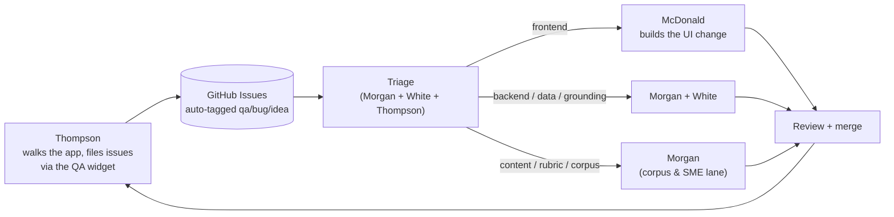

# Gameday team plan — who owns what

Four people, four lanes, one intake loop. Everyone has a clear job that maps to a real part
of the winning platform, and the hand-offs between lanes are explicit so nobody blocks or
collides. Read this with [`RANGE-CARD.md`](RANGE-CARD.md) (the operator's brief) and
[`COLD-BORE.md`](COLD-BORE.md) (the battle plan); the deep specs are in [`../`](../README.md).

## The team

| Member | Lane | One-line mission |
|---|---|---|
| **Morgan (Jesse)** | Lead · grounding, integration & corpus | Own Anchor + the doctrine seam + wiring the 12 soldiers; own the corpus and the human-in-the-loop guardrail |
| **White** | Backend & function (LMS host) | Own the Next.js/Prisma app, data layer, API routes — make every surface flow |
| **McDonald** | Frontend implementation (mentored) | Build the screens from the design system; turn QA/product asks into real UI |
| **Thompson** | QA & product voice | Walk it as a Marine, file bugs/ideas via the widget, own the issue board |

## The intake loop (how work flows)

Thompson's QA widget is the front door for everything the product needs: he files it with the
context auto-captured, it lands as a GitHub issue, triage routes it, the right lane makes it real.

---

## Morgan (Jesse) — Lead · grounding, integration & corpus
**Owns:** Anchor + the Orin, the doctrine adapter (`lib/doctrine.js` / `DOCTRINE_BASE_URL`), the
grounded pipeline (Author/Deliver/Improve), env/secrets, offline verification, the final
architecture call with White — **and** the corpus + the human-in-the-loop guardrail that keeps
the platform honest.
**Gameday tasks (engineering):**
- Bring Anchor up + tunnel; run `ops/orin-check.sh` each morning (all green before anyone demos).
- Wire the four integration sequences (see RANGE-CARD.md) — Studio→Quarry+Coursewright+Anchor; Ask→Sourcerer+Anchor+Understudy; Mastery→Whetstone; Improve→Sextant/Hotwash.
- Consume the 12 soldiers (`npm i github:groundworklms/<repo>`), keep the cite-or-refuse guarantee enforced.
- Prove offline (pull the network; tutor still answers; refusal still fires).
**Gameday tasks (content & SME — the guardrail):**
- Source and **screen for releasability** the 28xx / 06xx doctrine (POIs, outlines, sample assessments); run ingest (`quarry`) → the Anchor corpus. Track it on the corpus board (COLD-BORE.md).
- Curate the golden course so the demo always has a banked artifact.
- Feed real T&R standards to `rubricon` and **ratify** generated items (approve/edit/reject) — "the instructor owns the truth," made real. Nothing `PENDING` ships.
- Own the submission package + decision log + the honest scorecard (COLD-BORE.md → HONESTY).
**Reads:** the whole `../` stack, esp. `02-architecture`, `04-grounding-and-anchor`, `05-arsenal-contracts`, `08-build-guide`, plus `07-instructor-loop` (review/rubrics/AAR) and `03-data-model` (Item/citation/status) for the SME lane.

## White — Backend & function (LMS host)
**Owns:** the Next.js 15 app + Prisma (the schema in `../03-data-model.md`), `/api/*` route handlers
and server actions, the Course→Section→Item lifecycle, Attempt/Mastery/Schedule, the roles/auth seam,
and SCORM/LTI export seams. Makes the surfaces flow smooth with the agreed frontend.
**Gameday tasks:**
- Stand up the data layer (migrate + seed a TC 3-22.9 course + instructor + learner).
- Own the API contracts each screen calls; keep the human-in-the-loop review real (nothing `PENDING` ships).
- Pair with Jesse on the backend↔grounding contracts and with McDonald on the frontend↔API contracts.
- Wire Cartridge (SCORM export) + the LTI/`externalId` seam.
**Reads:** `03-data-model`, `02-architecture`, `05-arsenal-contracts`, `04-grounding-and-anchor`.

## McDonald — Frontend implementation (mentored)
**Owns:** building and refining the screens in White's design — turning Thompson's issues and the
agreed product direction into real, on-brand UI. This is the "make it real" lane; Morgan/White pair
and unblock. Start with well-scoped, high-learning tickets and grow.
**Ramp (day one, Jesse walks you in):**
1. Install: Node 18+, VS Code, Git, Claude Code. `git clone` the repo; `npm install`; `npm run dev` → open `http://localhost:3111/learn`.
2. Read `../01-design-system.md` — the tokens, the shell, the component catalog. That file is your source of truth for how things should look.
3. First tickets (safe, visible wins): implement one screen from `../06-learner-loop.md` / `../07-instructor-loop.md` using the design-system components; then pick up a QA issue Thompson filed and make the fix.
4. Workflow: branch → change → `npm run dev` to see it → push → Morgan/White review. Ask early, commit often.
**Claude instance:** point it at `../01-design-system.md` + the loop docs + the live `app.html` as the visual target; ask it to build a component/screen to spec, then you review it in the browser.

## Thompson — QA & product voice
**Owns:** the product from the Marine's eyes. No code required.
**Gameday tasks:**
- Walk the deployed showcase (`jeranaias.github.io/grounded-training-demo`, both the landing and `/app.html`) and the live app as a student *and* an instructor.
- File every bug **and** every idea via the **QA widget** (bottom-left) — it auto-captures where you are and opens a GitHub issue; pick `bug` / `idea` / `question`.
- Own the issue board: which are most important, which block the demo, what would make a judge say "wow."
- Shape the 5-minute run-of-show from the user's perspective (see RANGE-CARD.md → SHOW).
**Reads:** `../06-learner-loop.md` + `../07-instructor-loop.md` so you know what "correct" looks like; RANGE-CARD.md for the demo beats.

---

## Shared rhythm
- **Each morning:** Morgan runs `ops/orin-check.sh` (engine green); quick triage of Thompson's overnight issues; assign lanes.
- **Contracts before code:** backend (White/Morgan) and frontend (McDonald) agree the API/props shape for a screen *before* building it — the design system + data model are the shared language.
- **Cite-or-refuse is non-negotiable:** nothing ungrounded ships; nothing `PENDING` reaches a learner. Morgan is the human ratifier.
- **Demo-first:** if it isn't in the 5-minute run-of-show, it's a bonus, not a blocker. Keep the banked golden course as the safety net.

## Setup (every member, once)
1. `git clone` the repo (the fresh `SchoolCircleLMS` once it exists; until then, `grounded-training-demo`).
2. Read `docs/gameday/RANGE-CARD.md` + `docs/gameday/COLD-BORE.md` + `docs/README.md`.
3. Point your Claude Code instance at your lane's docs (listed above). You're armed.
